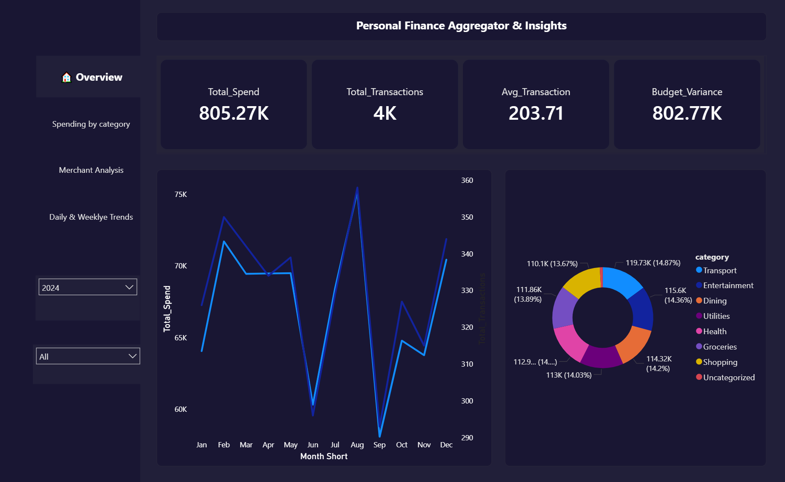
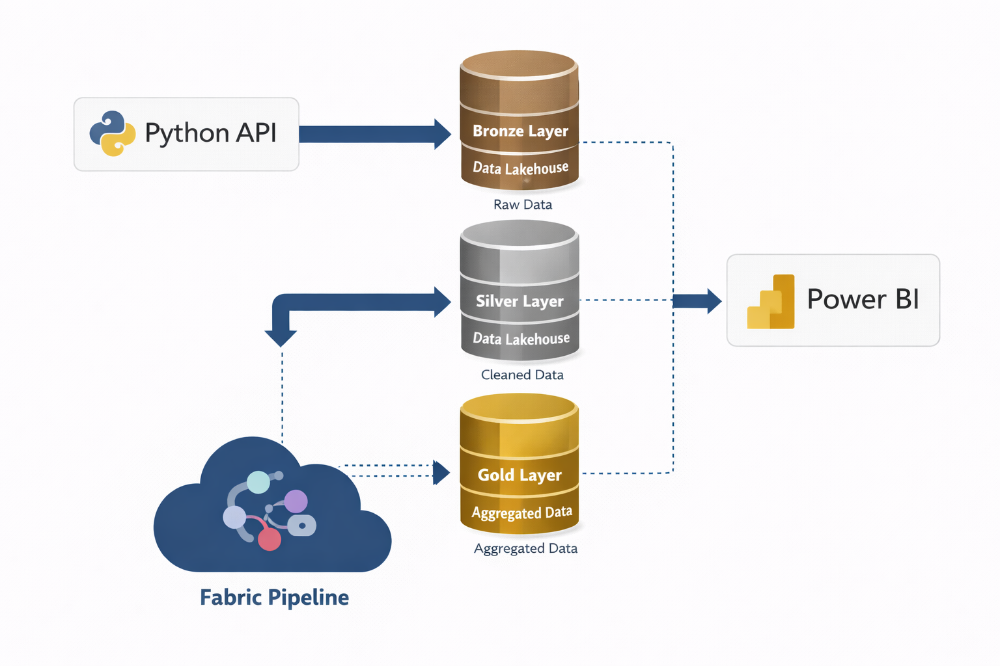
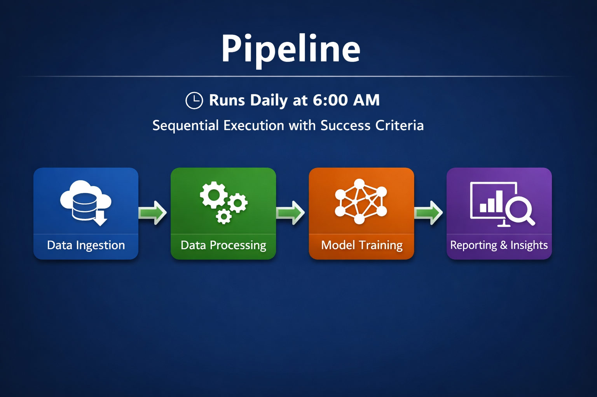
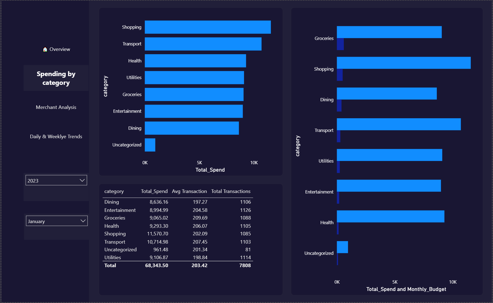
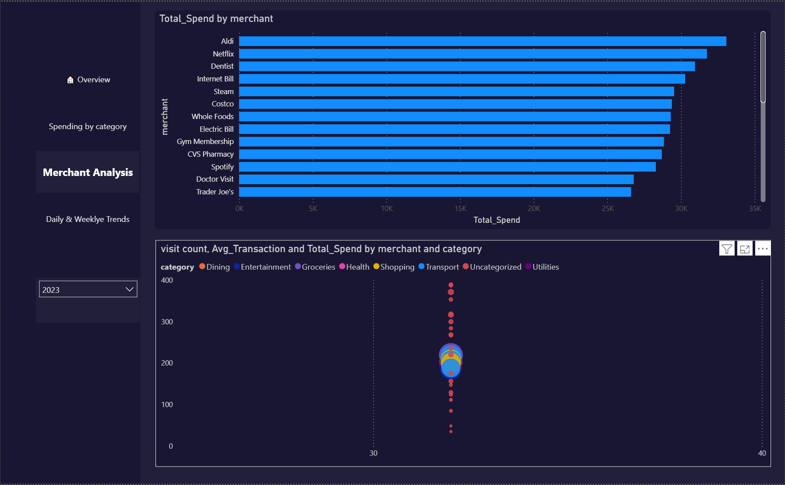

# finance-intelligence-platform

An end-to-end data engineering project built on Microsoft Fabric, 
Apache Spark and Power BI — transforming raw transaction data into 
financial insights using Medallion Architecture.



---

##  Project Overview

This project simulates a real-world data platform for personal finance 
analytics. Raw transaction data flows through a Bronze → Silver → Gold 
medallion architecture, culminating in an interactive Power BI dashboard 
that updates automatically every day via a scheduled Fabric pipeline.

**Key questions this platform answers:**
- Where am I spending my money each month?
- Which merchants and categories consume the most budget?
- How does my actual spending compare to my budget targets?
- What are my daily and weekly spending patterns?
---


## Architecture


```
Raw CSV Data
    ↓
[Bronze Layer]  →  Raw Delta table with audit metadata
    ↓
[Silver Layer]  →  Cleaned, deduplicated, enriched Delta table  
    ↓
[Gold Layer]    →  4 aggregated business-ready Delta tables
    ↓
[Power BI]      →  Interactive dashboard via Direct Lake
    ↓
[Fabric Pipeline] → Fully automated, runs daily at 6AM

```


---

##  Tech Stack

| Tool | Purpose |
|------|---------|
| Microsoft Fabric | Cloud data platform |
| Apache Spark (PySpark) | Data processing & transformation |
| Delta Lake | Storage format (ACID, versioning) |
| Power BI Direct Lake | Real-time dashboard |
| Fabric Data Pipeline | Orchestration & scheduling |
| Python | Data generation & scripting |

---

##  Project Structure
```
finance-intelligence-platform/
│
├── notebooks/
│   ├── 01_data_generation.ipynb     # Synthetic transaction data
│   ├── 02_bronze_layer.ipynb        # Raw ingestion + metadata
│   ├── 03_silver_layer.ipynb        # Cleaning & enrichment
│   ├── 04_gold_layer.ipynb          # Aggregations & business logic
│   └── 05_pipeline_orchestration.ipynb
│
├── data/sample/
│   └── transactions_sample.csv      # 100-row sample for reference
│
├── screenshots/                     # Dashboard & architecture visuals
├── docs/
│   └── architecture.md              # Detailed architecture notes
│
└── README.md
```

---

##  Data Pipeline



The pipeline runs daily at 6AM and executes four stages in sequence,
with each stage only proceeding if the previous one succeeded.

**Bronze** — Raw CSV ingested into Delta table with `ingestion_timestamp` 
and `source_file` audit columns stamped on every row.

**Silver** — Duplicates removed, nulls handled, strings standardized, 
date parsed, and 6 derived columns added including `year`, `month`, 
`quarter`, `is_weekend`, and `amount_bucket`.

**Gold** — Four aggregated tables built:
- `gold_monthly_spending` — monthly rollups with transaction stats
- `gold_category_summary` — spend by category with % of total
- `gold_merchant_summary` — top merchants by spend and visit frequency  
- `gold_daily_trends` — day-by-day patterns with weekend flagging
- `gold_budget_reference` — monthly budget targets per category

---


##  Dashboard

The Power BI report has 4 pages connected via Direct Lake mode — 
zero data import, queries run directly against Delta tables in OneLake.

**Page 1 — Executive Overview**


**Page 2 — Category Breakdown**


**Page 3 — Merchant Analysis**


**Page 4 — Daily & Weekly Trends**


---


## Contact

Made by Pius K Osei
[LinkedIn](www.linkedin.com/in/piusosei)